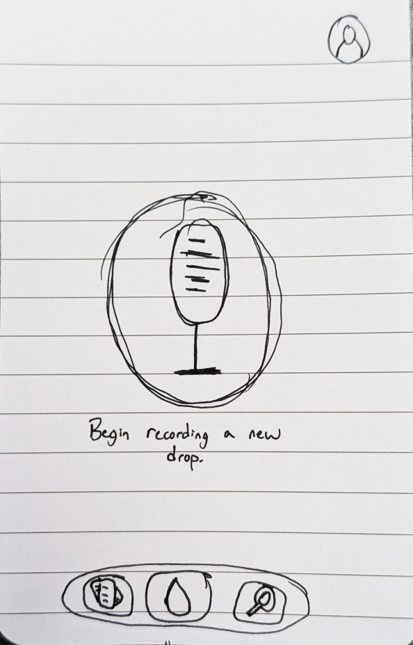
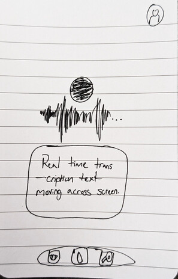
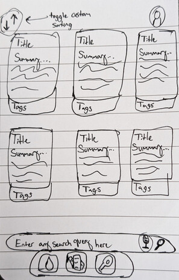
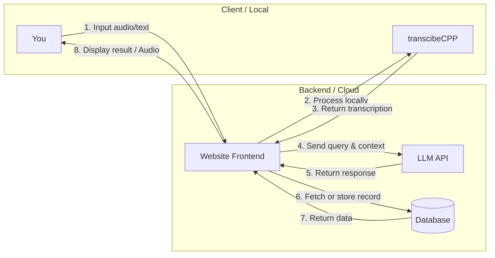

# Liquid Notes

[My Notes](notes.md)

Liquid Notes is a dynamic knowledge database that transforms how you capture and connect your ideas. Instead of forcing you to manually organize folders or search through static text, Liquid Notes uses local voice transcription and an intelligent AI agent to record, organize, and automatically link & present your thoughts together.

### Elevator pitch

Traditional note apps force you to spend more time organizing folders than actually thinking. Liquid Notes is a voice-first knowledge base where an on-device AI automatically transcribes, organizes, and links your ideas together in real time. Instead of searching through static files, your database adapts dynamically to your queries, surfacing hidden connections and letting your thoughts branch naturally.

### Design

Built from the ground up on a "less is more" philosophy, the interface delivers a natural, fluid navigation experience. Every element is placed intentionally for effortless one-hand mobile navigation. Screens seamlessly cascade into one another, turning transitions into a continuous journey rather than abrupt jumps. The design stands apart from the standard lifeless web designs of this age and creates a unique and minimal feel that encourages users to interact and deepen their thought-processes.

Here is a sequence diagram that demonstrates the backend.

### Key features

- Auto-linking key topics between notes
- Accurate local voice transcription
- Note summaries & dynamic search results

### Technologies

I am going to use the required technologies in the following ways.

- **HTML** - Uses correct HTML structure for single-page application entry point and optimized mobile viewport configurations.
- **CSS** - Mobile first, dynamically scaling interface.
- **React** - Single-page application managing component views for voice recording, real-time transcription feedback and backend endpoint synchronization.
- **Service** - Backend service providing endpoints for:
    - managing local voice transcription data
    - processing queries through a [AI agent API](https://ai.google.dev/gemini-api/docs)
    - retrieving, organizing, and linking knowledge nodes
    - registering, logging in, and logging out users with securely stored credentials
- **DB/Login** - Stoers user authentication data, voice recordings, transcribed text chunks, and relational idea links in the database.
- **WebSocket** - Live transcription data is displayed in real-time.

## 🚀 Specification Deliverable

For this deliverable I did the following. I checked the box `[x]` and added a description for things I completed.

- [x] I completed the prerequisites for this deliverable (Git commit requirement)
- [x] Proper use of Markdown
- [x] A concise and compelling elevator pitch
- [x] Description of key features
- [x] Description of how you will use each technology including your 3rd party API and use of WebSocket
- [x] One or more rough sketches of your application. Images must be embedded in this file using Markdown image references.

## 🚀 AWS deliverable

For this deliverable I did the following. I checked the box `[x]` and added a description for things I completed.

- [x] **Rented EC2 server** - Using my homeserver running an Nginx & Lets Encrypt docker image
- [x] **Leased domain name** - Already own plug-world.com domain name with CNAME wildcard
- [x] **Server accessible** from my domain: [https://startup.plug-world.com](https://startup.plug-world.com)

## 🚀 HTML deliverable

For this deliverable I did the following. I checked the box `[x]` and added a description for things I completed.

- [x] I completed the prerequisites for this deliverable (Simon deployed, GitHub link, Git commits)
- [x] **HTML pages** - 4 HTML pages consisting of home, search, about, & my account.
- [x] **Proper HTML element usage** - Nav bar uses navigation tags. Many structural tags used properly as well: header, footer, & input text field.
- [x] **Links** - Links to each page in the navbar; link to the source-code, change password & logout links.
- [x] **Text** - About page contains an in-depth explanation of the application, it's purpose, and what it solves; it also includes key definitions.
- [x] **3rd party API placeholder** - I did not complete this part of the deliverable.
- [ ] **Images** - I did not complete this part of the deliverable.
- [x] **Login placeholder** - Login page included in navigation bar with the username placeholder text. Page includes a logout & change password link.
- [x] **DB data placeholder** - I did not complete this part of the deliverable.
- [x] **WebSocket placeholder** - I did not complete this part of the deliverable.

## 🚀 CSS deliverable

For this deliverable I did the following. I checked the box `[x]` and added a description for things I completed.

- [ ] I completed the prerequisites for this deliverable (Simon deployed, GitHub link, Git commits)
- [ ] **Visually appealing colors and layout. No overflowing elements.** - I did not complete this part of the deliverable.
- [ ] **Use of a CSS framework** - I did not complete this part of the deliverable.
- [ ] **All visual elements styled using CSS** - I did not complete this part of the deliverable.
- [ ] **Responsive to window resizing using flexbox and/or grid display** - I did not complete this part of the deliverable.
- [ ] **Use of a imported font** - I did not complete this part of the deliverable.
- [ ] **Use of different types of selectors including element, class, ID, and pseudo selectors** - I did not complete this part of the deliverable.

## 🚀 React part 1: Routing deliverable

For this deliverable I did the following. I checked the box `[x]` and added a description for things I completed.

- [ ] I completed the prerequisites for this deliverable (Simon deployed, GitHub link, Git commits)
- [ ] **Bundled using Vite** - I did not complete this part of the deliverable.
- [ ] **Components** - I did not complete this part of the deliverable.
- [ ] **Router** - I did not complete this part of the deliverable.

## 🚀 React part 2: Reactivity deliverable

For this deliverable I did the following. I checked the box `[x]` and added a description for things I completed.

- [ ] I completed the prerequisites for this deliverable (Simon deployed, GitHub link, Git commits)
- [ ] **All functionality implemented or mocked out** - I did not complete this part of the deliverable.
- [ ] **Hooks** - I did not complete this part of the deliverable.

## 🚀 Service deliverable

For this deliverable I did the following. I checked the box `[x]` and added a description for things I completed.

- [ ] I completed the prerequisites for this deliverable (Simon deployed, GitHub link, Git commits)
- [ ] **Node.js/Express HTTP service** - I did not complete this part of the deliverable.
- [ ] **Static middleware for frontend** - I did not complete this part of the deliverable.
- [ ] **Calls to third party endpoints** - I did not complete this part of the deliverable.
- [ ] **Backend service endpoints** - I did not complete this part of the deliverable.
- [ ] **Frontend calls service endpoints** - I did not complete this part of the deliverable.
- [ ] **Supports registration, login, logout, and restricted endpoint** - I did not complete this part of the deliverable.
- [ ] **Uses BCrypt to hash passwords** - I did not complete this part of the deliverable.

## 🚀 DB deliverable

For this deliverable I did the following. I checked the box `[x]` and added a description for things I completed.

- [ ] I completed the prerequisites for this deliverable (Simon deployed, GitHub link, Git commits)
- [ ] **Stores data in MongoDB** - I did not complete this part of the deliverable.
- [ ] **Stores credentials in MongoDB** - I did not complete this part of the deliverable.

## 🚀 WebSocket deliverable

For this deliverable I did the following. I checked the box `[x]` and added a description for things I completed.

- [ ] I completed the prerequisites for this deliverable (Simon deployed, GitHub link, Git commits)
- [ ] **Backend listens for WebSocket connection** - I did not complete this part of the deliverable.
- [ ] **Frontend makes WebSocket connection** - I did not complete this part of the deliverable.
- [ ] **Data sent over WebSocket connection** - I did not complete this part of the deliverable.
- [ ] **WebSocket data displayed** - I did not complete this part of the deliverable.
- [ ] **Application is fully functional** - I did not complete this part of the deliverable.
